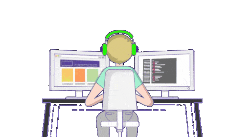

<picture>
  <source media="(prefers-color-scheme: dark)" srcset="https://capsule-render.vercel.app/api?type=rect&color=ececec&height=2&section=header">
  <source media="(prefers-color-scheme: light)" srcset="https://capsule-render.vercel.app/api?type=rect&color=1a1a1a&height=2&section=header">
  
</picture>    
<table border="1" cellpadding="20" cellspacing="0" width="90%">
  <tr>
    <td width="53%" valign="top">
      <h3>👨‍💻 Who am I?</h3>
      

I’m <b>Uday Bodana,</b> a <b>Full Stack Developer</b> focused on building clean, scalable, and efficient web applications. &nbsp;🚀
      

       
      <ul>
        <li>🎓 &nbsp;Final Year <b>B.Tech (CSE)</b> student at <a href="https://www.iiitn.ac.in"><b>IIIT Nagpur</b></a></li>
        <li>🌱 &nbsp;Currently exploring <b>Full Stack Development</b></li>
        <li>💡 &nbsp;Developing scalable <b>web applications and APIs</b></li>
        <li>💬 &nbsp;Ask me about <b>JavaScript, React, Node.js, and MongoDB</b></li>
        <li>⚡ &nbsp;Focused on <b>clean, efficient, and maintainable code</b></li>
       
      </ul>
    </td>
    <td width="47%" valign="middle" align="center">
        &nbsp;&nbsp;
      
      
    </td>
  </tr>
</table>
 

<picture>
  <source media="(prefers-color-scheme: dark)" srcset="https://capsule-render.vercel.app/api?type=rect&color=ececec&height=2&section=header">
  <source media="(prefers-color-scheme: light)" srcset="https://capsule-render.vercel.app/api?type=rect&color=1a1a1a&height=2&section=header">
  
</picture>

<h3 align="center">⚡Tech Stack</h3>

<table width="100%">
  <thead>
    <tr>
      <th align="center">🌐 Frontend & Backend</th>
    </tr>
  </thead>
  <tbody>
    <tr>
      <td align="center">
           
                   &nbsp;&nbsp;&nbsp;
                   &nbsp;&nbsp;&nbsp;
                   &nbsp;&nbsp;&nbsp;
                   &nbsp;&nbsp;&nbsp;
                   &nbsp;&nbsp;&nbsp;
                   &nbsp;&nbsp;&nbsp;
                   &nbsp;&nbsp;&nbsp;
                   &nbsp;&nbsp;&nbsp;
                   &nbsp;&nbsp;&nbsp;
                             
            
      </td>
    </tr>
    <tr>
      <th align="center">💻 Languages & Tools</th>
    </tr>
    <tr>
      <td align="center">
           
           &nbsp;&nbsp;&nbsp;
           &nbsp;&nbsp;&nbsp;
           &nbsp;&nbsp;&nbsp;
           &nbsp;&nbsp;&nbsp;
           &nbsp;&nbsp;&nbsp;
           &nbsp;&nbsp;&nbsp;
           &nbsp;&nbsp;&nbsp;
          
            
      </td>
    </tr>
  </tbody>
</table>

<picture>
  <source media="(prefers-color-scheme: dark)" srcset="https://capsule-render.vercel.app/api?type=rect&color=ececec&height=2&section=header">
  <source media="(prefers-color-scheme: light)" srcset="https://capsule-render.vercel.app/api?type=rect&color=1a1a1a&height=2&section=header">
  
</picture>

<h3 align="center">🤝 Let's Connect</h3>

<table border="1" cellpadding="20" cellspacing="0" width="90%">
  <tr>
    <td align="center" width="25%">
      <b>💼 LinkedIn</b>  
      
    </td>
    <td align="center" width="25%">
      <b>📧 Gmail</b>  
      
    </td>
    <td align="center" width="25%">
      <b>🔆 GitHub</b>  
      
    </td>
        <td align="center" width="25%">
      <b>🌐 Portfolio</b>  
      
    </td>
  </tr>
</table>
  ✨ <i>Let's connect and build something amazing together!</i> ✨
  

<picture>
  <source media="(prefers-color-scheme: dark)" srcset="https://capsule-render.vercel.app/api?type=rect&color=ececec&height=2&section=header">
  <source media="(prefers-color-scheme: light)" srcset="https://capsule-render.vercel.app/api?type=rect&color=1a1a1a&height=2&section=header">
  
</picture>

<h3 align="center">🏆 GitHub Analytics</h3>

<picture>
  <source media="(prefers-color-scheme: dark)" srcset="https://capsule-render.vercel.app/api?type=rect&color=ececec&height=2&section=header">
  <source media="(prefers-color-scheme: light)" srcset="https://capsule-render.vercel.app/api?type=rect&color=1a1a1a&height=2&section=header">
  
</picture>

<h3 align="center">💡 Dev Quote of the Day</h3>

  

<picture>
  <source media="(prefers-color-scheme: dark)" srcset="https://capsule-render.vercel.app/api?type=rect&color=ececec&height=2&section=header">
  <source media="(prefers-color-scheme: light)" srcset="https://capsule-render.vercel.app/api?type=rect&color=1a1a1a&height=2&section=header">
  
</picture>

  <picture width="100%">
    <source media="(prefers-color-scheme: dark)" srcset="https://raw.githubusercontent.com/platane/snk/output/github-contribution-grid-snake-dark.svg">
    <source media="(prefers-color-scheme: light)" srcset="https://raw.githubusercontent.com/platane/snk/output/github-contribution-grid-snake.svg"> 
     
  </picture>

 

<picture>
  <source media="(prefers-color-scheme: dark)" srcset="https://capsule-render.vercel.app/api?type=rect&color=ececec&height=2&section=header">
  <source media="(prefers-color-scheme: light)" srcset="https://capsule-render.vercel.app/api?type=rect&color=1a1a1a&height=2&section=header">
  
</picture>
